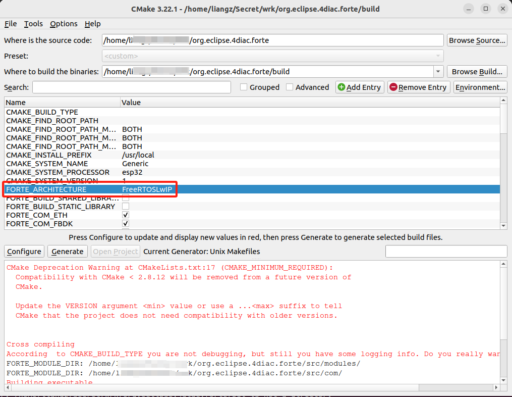
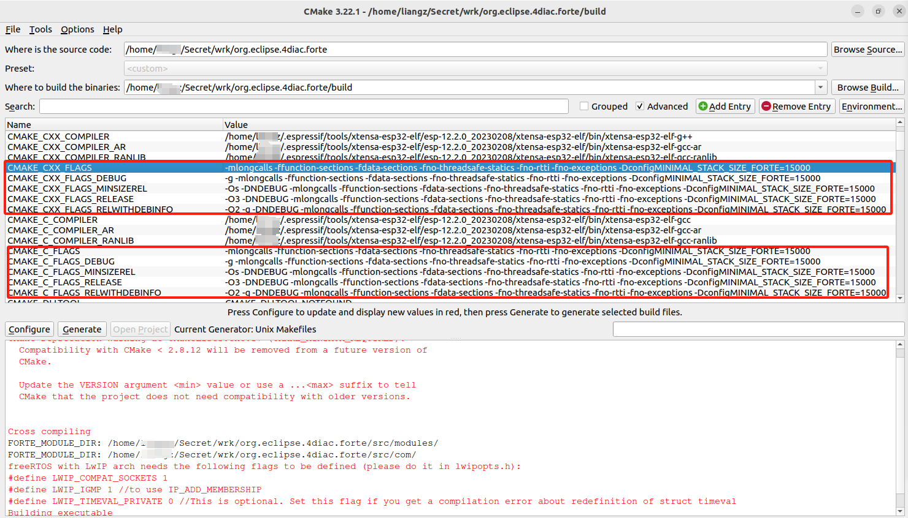

# ESP 4diac FORTE Library 

- [ESP 4diac FORTE Library](#esp-4diac-forte-library)
	- [Overview](#overview)
	- [Requirements](#requirements)
	- [Step 1. Compile FORTE to a static library](#step-1-compile-forte-to-a-static-library)
		- [Step 1.1. Get source code](#step-11-get-source-code)
		- [Step 1.2. Set CMake](#step-12-set-cmake)
		- [Step 1.3. Configure the compilation](#step-13-configure-the-compilation)
		- [Step 1.5. Generate files](#step-15-generate-files)
		- [Step 1.6. Build 4diac FORTE](#step-16-build-4diac-forte)
	- [Step 2. Add the FORTE library to `ESP 4diac FORTE Component` - This repository](#step-2-add-the-forte-library-to-esp-4diac-forte-component---this-repository)
		- [Step 2.1. Clone this repository](#step-21-clone-this-repository)
		- [Step 2.2. Add the FORTE library](#step-22-add-the-forte-library)
	- [Step 3. Sample FORTE application](#step-3-sample-forte-application)

## Overview

[ESP-4diac-FORTE](https://github.com/hikiku/esp-4diac-forte) is a standard [ESP-IDF](https://github.com/espressif/esp-idf) component.

4diac FORTE is an open source PLC runtime framework based on IEC 61499 standard. This how-to describes how to run it on esp32 or esp32s2 mcu.  For more details about 4diac FORTE please visit. https://www.eclipse.org/4diac/en_rte.php. 

Based on:

- [**4diac FORTE for freeRTOS + LwIP**](https://eclipse.dev/4diac/en_help.php?helppage=html/installation/freeRTOSLwIP.html)
- [**4diac FORTE Esp32 Component**](https://gitlab.com/meisterschulen-am-ostbahnhof-munchen/4diac-forte-esp32-component) 
- [
**esp32 4diac example application**](https://gitlab.com/meisterschulen-am-ostbahnhof-munchen/esp32-4diac-example-application).

## Requirements
- Linux operating system - Ubuntu / Debian / Arch.
- Visual Studio Code.
- with Espressif plugin for ESP32 chips support - `Espressif IDF`, [install and setup the extension](https://github.com/espressif/vscode-esp-idf-extension/blob/HEAD/docs/tutorial/install.md).
- ESP-IDF - should be installed by VS Code plugin.
- Git, make, cmake and cmake-gui:
  	`sudo apt-get install git make cmake cmake-gui`

**Also it is assumed that user has basic knowledge about C/C++ programming, esp32 platform and required toolchains.**

It is good to test all nessecery tools before proced this instruction.

## Step 1. Compile FORTE to a static library

### Step 1.1. Get source code
Clone latest 4diac FORTE repository:

```bash
$ git clone https://git.eclipse.org/r/4diac/org.eclipse.4diac.forte.git
```

It is important to have it in some accesible place so we can easly come back to it. For propose of this text, `/home/liangz/Secret/wrk/` has been used. 

### Step 1.2. Set CMake

1. Open CMake-GUI
   In next step in forte root folder create build directory and launch cmake gui tool. It can be done via terminal commad

	```bash
	$ cmake-gui
	```

1. Complete as shown in the image
   1. Set the 4diac FORTE source path where you cloned the Git repository, e.g.:`/home/liangz/Secret/wrk/org.eclipse.4diac.forte`.
   1. Set path for binaries where you want to create the library, e.g.:`/home/liangz/Secret/wrk/org.eclipse.4diac.forte/build`. ~~Normally, bin/freeRTOS is used.~~
   1. Press <kbd>Configure</kbd> and new window will appear with configuration wizard. 

    

1. In new window, select the correct option
   1. Select the tool you normally use to compile your programs. This example follows using `UNIX Makefiles` from the list.
   1. Select `Specify options for cross-compiling`.
   1. Press <kbd>Next-></kbd>

   

1. Setup for cross-compilation. You have to select GCC and G++ compilers for xtensa atchitecture
   1. Write Operating System to **Generic** (normally freeRTOS, it won't affect the compilation)
   1. Write Processor to **esp32** or **esp32s2**
   1. Select the path of the C cross-compiler to **/home/liangz/.espressif/tools/xtensa-esp32-elf/esp-12.2.0_20230208/xtensa-esp32-elf/bin/xtensa-esp32-elf-gcc**
   1. Select the path of the C++ cross-compiler to **/home/liangz/.espressif/tools/xtensa-esp32-elf/esp-12.2.0_20230208/xtensa-esp32-elf/bin/xtensa-esp32-elf-g++**
   1. The target root field can be left empty.
   1. Click <kbd>Finish</kbd>

   

### Step 1.3. Configure the compilation
A list with all variables of 4diac FORTE in red should be shown in CMake. 


1. For esp32 we have to set the `FORTE_ARCHITECTURE` variable to `FreeRTOSLwIP` Now when click <kbd>Configure</kbd>, most errors should dissapear. 

2. Check the information that appears in CMake about the LwIP configuration.
3. The variable `FORTE_FreeRTOSLwIP_INCLUDES` should appear now and it is the most important one. You should set it to the several paths where the freeRTOS and LwIP headers are, each separated by a semicolon. For example: `${MAIN_DIRECTORY}/FreeRTOS/portable;${MAIN_DIRECTORY}/include;${MAIN_DIRECTORY}/lwip/src/include;${MAIN_DIRECTORY}/lwip/port` where `${MAIN_DIRECTORY}` is the path where you have your freeRTOS and LwIP code. When you later compile and it fails with an error saying that some "includes" are missing, this variable should be updated where the folders where the missing files are located.
Parameter `FORTE_FreeRTOSLwIP_INCLUDES` has to be set. It takes string with semicolon separated paths to include folders in esp-idf. There is quite a lot of paths that have to be added as include paths. Below there is a working configuration, please note that all of those paths are **absolue** so you need to modify all of them. In most cases it should be enought to repleace all occurrences of `/home/liangz/esp/esp-idf` with your ESP-IDF root directory path. For example with `/home/my_user/my_projects/my-idf_path`.


	```bash
	/home/liangz/test/blink/build/config;/home/liangz/esp/esp-idf/components/newlib/platform_include;/home/liangz/esp/esp-idf/components/freertos/FreeRTOS-Kernel/include;/home/liangz/esp/esp-idf/components/freertos/FreeRTOS-Kernel/include/freertos;/home/liangz/esp/esp-idf/components/freertos/FreeRTOS-Kernel/portable/xtensa/include;/home/liangz/esp/esp-idf/components/freertos/esp_additions/include/freertos;/home/liangz/esp/esp-idf/components/freertos/esp_additions/include;/home/liangz/esp/esp-idf/components/freertos/esp_additions/arch/xtensa/include;/home/liangz/esp/esp-idf/components/esp_hw_support/include;/home/liangz/esp/esp-idf/components/esp_hw_support/include/soc;/home/liangz/esp/esp-idf/components/esp_hw_support/include/soc/esp32;/home/liangz/esp/esp-idf/components/esp_hw_support/port/esp32/.;/home/liangz/esp/esp-idf/components/esp_hw_support/port/esp32/private_include;/home/liangz/esp/esp-idf/components/heap/include;/home/liangz/esp/esp-idf/components/log/include;/home/liangz/esp/esp-idf/components/soc/include;/home/liangz/esp/esp-idf/components/soc/esp32;/home/liangz/esp/esp-idf/components/soc/esp32/include;/home/liangz/esp/esp-idf/components/hal/esp32/include;/home/liangz/esp/esp-idf/components/hal/include;/home/liangz/esp/esp-idf/components/hal/platform_port/include;/home/liangz/esp/esp-idf/components/esp_rom/include;/home/liangz/esp/esp-idf/components/esp_rom/include/esp32;/home/liangz/esp/esp-idf/components/esp_rom/esp32;/home/liangz/esp/esp-idf/components/esp_common/include;/home/liangz/esp/esp-idf/components/esp_system/include;/home/liangz/esp/esp-idf/components/esp_system/port/soc;/home/liangz/esp/esp-idf/components/esp_system/port/include/private;/home/liangz/esp/esp-idf/components/xtensa/include;/home/liangz/esp/esp-idf/components/xtensa/esp32/include;/home/liangz/esp/esp-idf/components/lwip/include;/home/liangz/esp/esp-idf/components/lwip/include/apps;/home/liangz/esp/esp-idf/components/lwip/include/apps/sntp;/home/liangz/esp/esp-idf/components/lwip/lwip/src/include;/home/liangz/esp/esp-idf/components/lwip/port/include;/home/liangz/esp/esp-idf/components/lwip/port/freertos/include;/home/liangz/esp/esp-idf/components/lwip/port/esp32xx/include;/home/liangz/esp/esp-idf/components/lwip/port/esp32xx/include/arch
	```

	**Note**: replace `/home/liangz/test/blink/build/config` with your path of `sdkconfig.h`.
	
<!-- -DESP_PLATFORM 
-DIDF_VER=\"v5.1.2-dirty\" 
-DMBEDTLS_CONFIG_FILE=\"mbedtls/esp_config.h\" -DSOC_MMU_PAGE_SIZE=CONFIG_MMU_PAGE_SIZE 
-D_GNU_SOURCE 
-D_POSIX_READER_WRITER_LOCKS  -->

<!-- -mlongcalls -Wno-frame-address  -Wall -Wextra -Wwrite-strings -Wformat=2 -Wno-format-nonliteral -Wvla -Wlogical-op -Wshadow -Wformat-signedness -Wformat-overflow=2 -Wformat-truncation -Werror -Wmissing-declarations -Wmissing-prototypes -ffunction-sections -fdata-sections -Wall -Werror=all -Wno-error=unused-function -Wno-error=unused-variable -Wno-error=unused-but-set-variable -Wno-error=deprecated-declarations -Wextra -Wno-unused-parameter -Wno-sign-compare -Wno-enum-conversion -gdwarf-4 -ggdb -Og -fmacro-prefix-map=/home/liangz/test/hello_world=. -fmacro-prefix-map=/home/liangz/esp/esp-idf=/IDF -fstrict-volatile-bitfields -fno-jump-tables -fno-tree-switch-conversion -DconfigENABLE_FREERTOS_DEBUG_OCDAWARE=1 -std=gnu17 -Wno-old-style-declaration -MD -MT esp-idf/mbedtls/mbedtls/library/CMakeFiles/mbedx509.dir/x509_crt.c.obj -MF esp-idf/mbedtls/mbedtls/library/CMakeFiles/mbedx509.dir/x509_crt.c.obj.d -o esp-idf/mbedtls/mbedtls/library/CMakeFiles/mbedx509.dir/x509_crt.c.obj -c /home/liangz/esp/esp-idf/components/mbedtls/mbedtls/library/x509_crt.c -->

4. It might be the case that you also need to set the `CMAKE_C_FLAGS` and `CMAKE_CXX_FLAGS` variables with the flags needed for your hardware. You can check which flags you need from the proeperties of your example project in your cross-IDE.

	Once you have filed freertos includes you have add few additional *compiler flags*. To do this you need to activate `Advanced` checkbox in upper right corner of cmake program. Once you have it, you will be able to see much more options that you can tweak.

	*Flags* that you have to add:
	`-mlongcalls -ffunction-sections -fdata-sections -fno-threadsafe-statics -fno-rtti -fno-exceptions -DconfigMINIMAL_STACK_SIZE_FORTE=15000`

	All of them have to be added to all variants of `CMAKE_C_FLAGS` and `CMAKE_CXX_FLAGS`. There are: `DEBUG, MINISIZEREL RELEASE, REALWITHDEBINFO`

	It should looks similar to picture below.

	   

5. Next option to set is the `FORTE_TicksPerSecond` option to **100** instead of 1000. It is also visible in advanced mode. 
6. We also need to tell cmake that we want to build static library instead of execurable. To do this you have to set `FORTE_BUILD_EXECUTABLE` to *false/deselect* and `FORTE_BUILD_STATIC_LIBRARY` to *true/select*.
7. For first tests, it is good to enable debug feature in FORTE so we can see more logs. That is very usefull during first run so we can see that everything works as it should. To do this, in `CMAKE_BUILD_TYPE` type: `DEBUG` and switch `FORTE_LOGLEVEL` to `LOGDEBUG`. **Unfortunetly** `FORTE_LOGLEVEL` options automaticly switch back to `NOLOG` everytime we trigger configuration, so it's  important to remember about it when we do some changes and we expect to have logs.
<!-- 8. freeRTOS with LwIP arch needs the following flags to be defined (please do it in lwipopts.h, e.g.:`/home/liangz/esp/esp-idf/components/lwip/port/include/lwipopts.h`):
	```C
	#define LWIP_COMPAT_SOCKETS 1
	#define LWIP_IGMP 1 //to use IP_ADD_MEMBERSHIP
	#define LWIP_TIMEVAL_PRIVATE 0 //This is optional. Set this flag if you get a compilation error about redefinition of struct timeval
	``` -->

8. Click <kbd>Configure</kbd> and the variables that need revision will appear again in red and the rest in white. ~~Check these variables and press <kbd>Configure</kbd> until no variable is shown in red. Here you can add the modules that you want FORTE to have, but from the freeRTOS point of view, there's nothing else you need.~~

**Just to highlight changes that we have done here:**
- `FORTE_ARCHITECTURE` set to `FreeRTOSLwIP`
- `FORTE_FreeRTOSLwIP_INCLUDES` fillup all FreeRTOS include paths
- `CMAKE_C_FLAGS`, `CMAKE_CXX_FLAGS` and their variations with  `DEBUG, MINISIZEREL RELEASE, REALWITHDEBINFO` - add compilers flags. 
- `FORTE_TicksPerSecond` set to 100
- `FORTE_BUILD_EXECUTABLE` deselect
- `FORTE_BUILD_STATIC_LIBRARY` select
- `CMAKE_BUILD_TYPE` type `DEBUG`, `FORTE_LOGLEVEL` set to `LOGDEBUG` 


<!-- ### Step 1.5. Comment out connect()

Comment out connect() from FORTE source code.

At this point we can do the <kbd>configuration</kbd> and <kbd>generation</kbd> with cmake. But still we need to do some small change to FORTE code. Becasue esp-idf has it's own implementation of connect() function which wraps lwip_connect() we need to comment out connect function definition from FORTE source. Other way we will get compilation errors saying that we have redefinition of this function. 
The change has to be done in file `${FORTE_ROOT}/src/arch/freeRTOS/sockhand.h`. The function `connect(int s, const struct sockaddr *name, socklen_t namelen) `has to be commented.

so we change

```C
inline int connect(int s, const struct sockaddr *name, socklen_t namelen) {
	return lwip_connect(s, name, namelen);
}
```


to

```C
//inline int connect(int s, const struct sockaddr *name, socklen_t namelen) {
//  return lwip_connect(s, name, namelen);
//}
```

Once you have changed this file, save it, close and we can try first FORTE compilation for esp32 platform. -->

### Step 1.5. Generate files

* Click <kbd>Generate</kbd>

### Step 1.6. Build 4diac FORTE
* Go to the recently generated folder (e.g.： `${FORTE_ROOT}/build/src`) and type `make -j` your make tool should start doing all the jobs and as a result,

	```bash
	$ cd ${FORTE_ROOT}/build/src   # cd bin/freeRTOS
	$ make -j
	```

* If you got an error, check again the variables in CMake, specially `FORTE_FreeRTOSLwIP_INCLUDES`, `CMAKE_C_FLAGS` and `CMAKE_CXX_FLAGS`.

* If no error occurred, after some small amount of time, you should have builded FORTE static library like on the picture below: 

    

* Now you can find your static library in `${FORTE_ROOT}/build/src` ~~`bin/freeRTOS/src`~~ with name `libforte-static.a`. We will use this library to prepare our ESP component so it can be used directly in the esp project. 

## Step 2. Add the FORTE library to `ESP 4diac FORTE Component` - This repository

### Step 2.1. Clone this repository
The component is in **this** repository, you have to clone it into your `esp-idf/components` folder so it can be used in esp32 project.

Go to `esp-idf/components` folder and type:

`$ git clone https://gitlab.com/meisterschulen-am-ostbahnhof-munchen/4diac-forte-esp32-component.git`

### Step 2.2. Add the FORTE library

At this moment you can copy you static library to the FORTE component folder. ~~There is also need to rename it to forte.a.~~ It's good to make a symbolic link instead of hard copy of static library. To do this you can use ln command in your shell.  

`ln -s [soruce file] [destination file]`

for example:

~~`ln -s /home/liangz/Secret/wrk/org.eclipse.4diac.forte/build/src/libforte-static.a /home/liangz/esp/esp-idf/components/4diac-forte-esp32-component/forte.a`~~

```bash
cd /home/liangz/test/esp32-4diac-example-application/Application/components/4diac-forte-esp32-component/lib/esp32/src
mv libforte-static.a libforte-static.a.origin     # rf libforte-static.a
ln -s /home/liangz/Secret/wrk/org.eclipse.4diac.forte/build/src/libforte-static.a libforte-static.a
```

In this way you don't have to copy the library everytime you rebuild it. 


## Step 3. Sample FORTE application

To test you FORTE buld, you need eighter prepare your sample aplication from scratch or use the one that has been already prepared. This how-to will not cover how to make new project from scratch, instead we will use here an already prepared example which can be cloned from git repository. 

Clone the git repository 

```bash
# cd ~/test
$ git clone https://gitlab.com/meisterschulen-am-ostbahnhof-munchen/esp32-4diac-example-application.git
```
<!-- `$ git clone https://gitlab.com/arkadiusz.g/esp32-4diac-example-application.git` -->

Open your Visual Studio Code, and load the 4diac example application project. 

<kbd>CTRL</kbd>+<kbd>Shift</kbd>+<kbd>P</kbd> -> `ESP-IDF:>Set Espressif device target`

<kbd>CTRL</kbd>+<kbd>Shift</kbd>+<kbd>P</kbd> -> `ESP-IDF:>SDK Configuration Editor (menuconfig)`:
```menuconfig
Serial flasher config
	-> Flash SPI speed (40 MHz)
	-> Flash size (4 MB)
```

`partion.csv`:

```csv
# Name,   Type, SubType, Offset,  Size, Flags
# Note: if you have increased the bootloader size, make sure to update the offsets to avoid overlap
nvs,      data, nvs,     0x9000,  0x6000,
phy_init, data, phy,     0xf000,  0x1000,
factory,  app,  factory, 0x10000, 3M,
storage,  data, spiffs,  ,        0xF0000,
```


If you have everything properly installed project should build without any issues. Once you build it, flash and turn on ESP-IDF Monitor device. 

Once it's done you should see your 4diac FORTE up and running. 


Now you can deploy your sample application. To build your sample application with FORTE please refer to FORTE documentation : [Step 1 - Use 4diac Locally (Blinking Tutorial)]( https://www.eclipse.org/4diac/en_help.php?helppage=html/4diacIDE/use4diacLocally.html")

If everything is done correctly you should succesfully deploy your application. Enjoy! 


