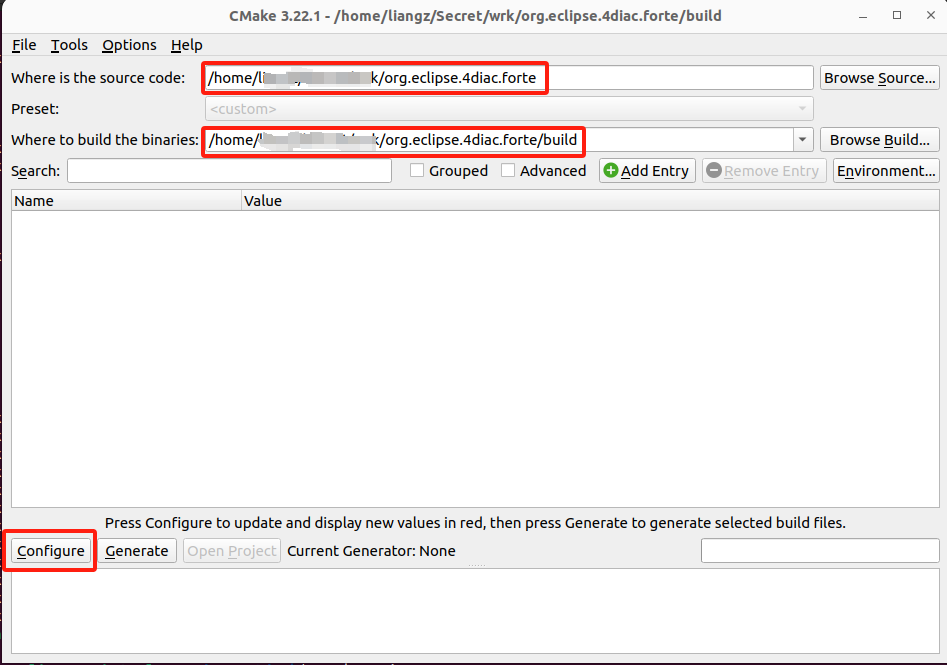
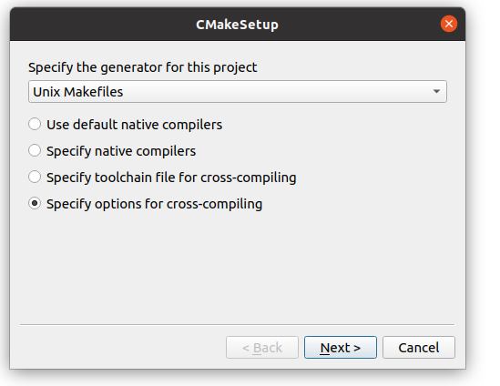
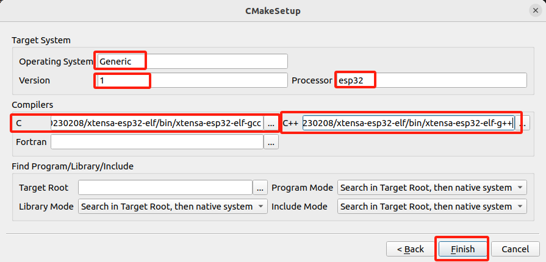
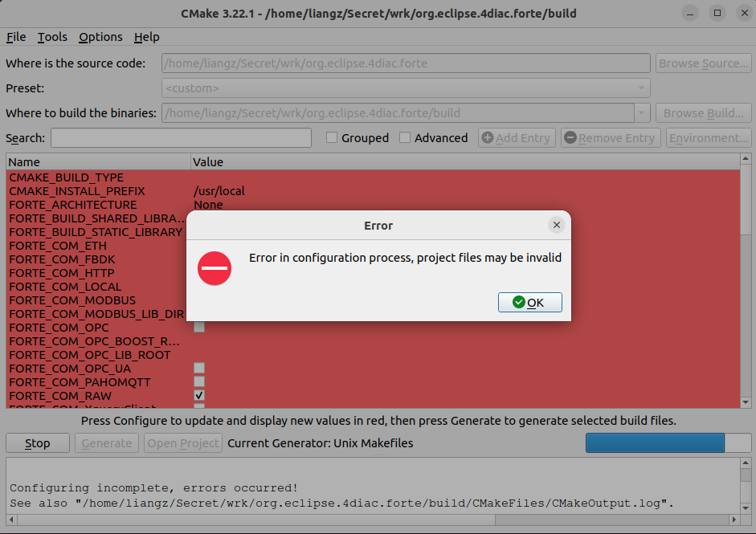
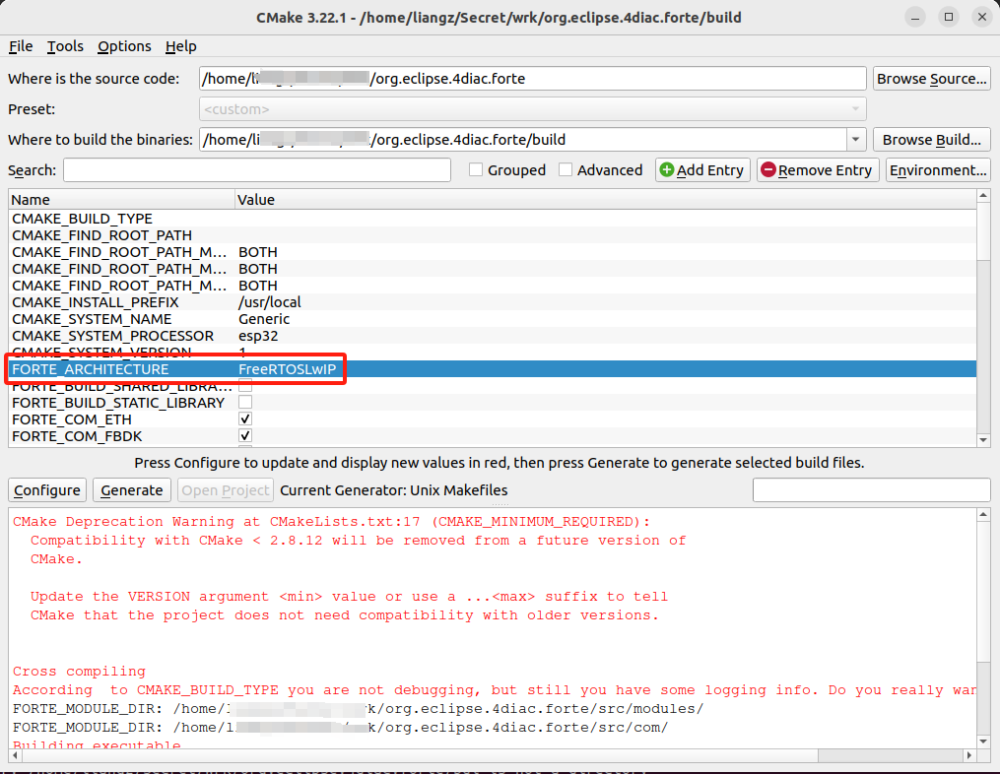
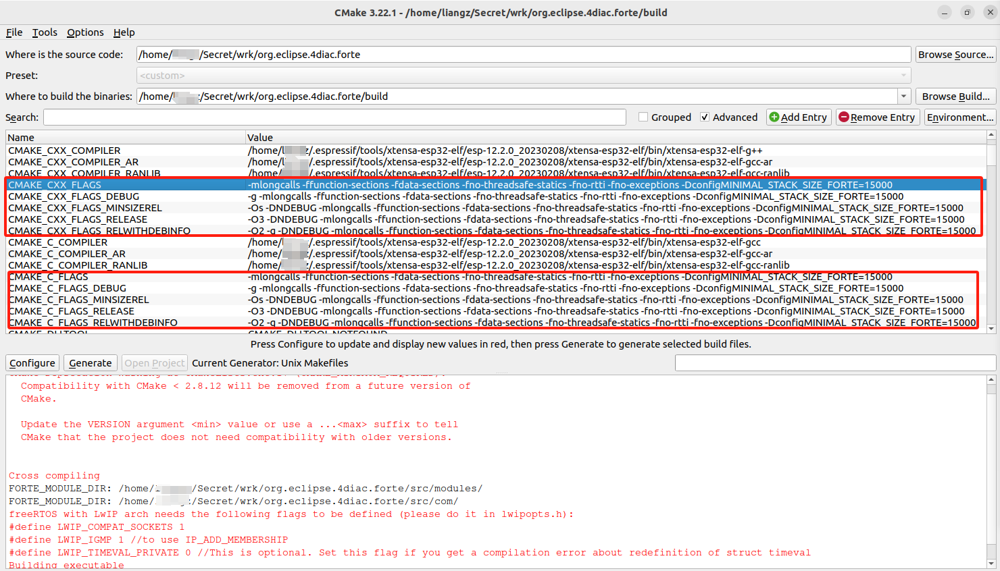
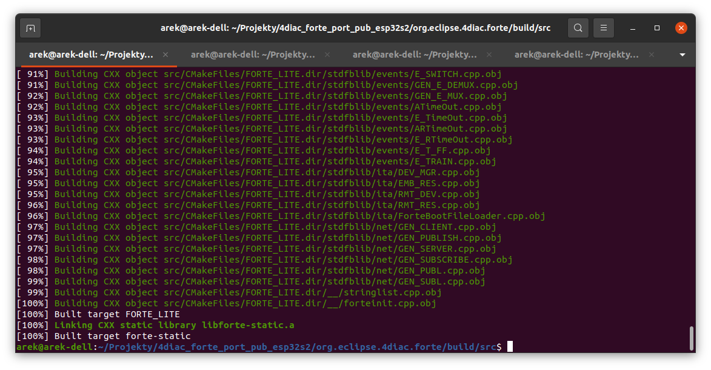
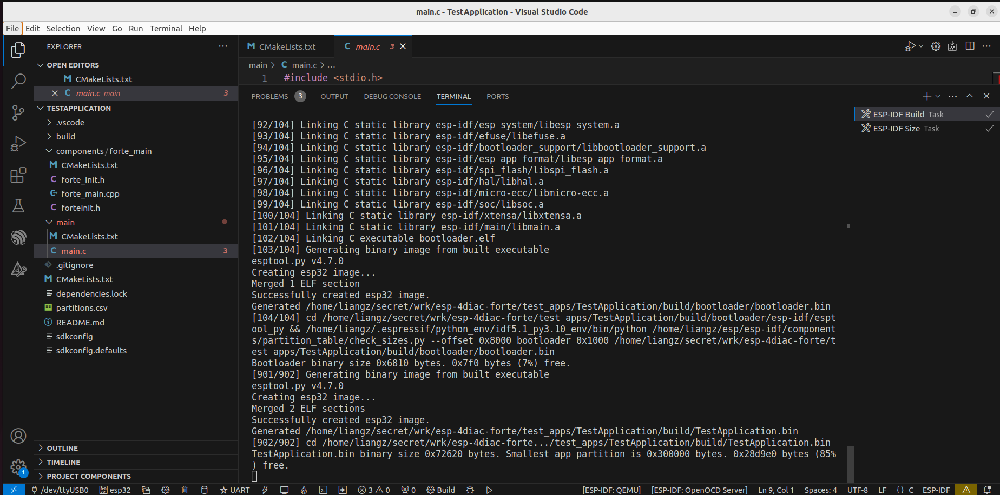
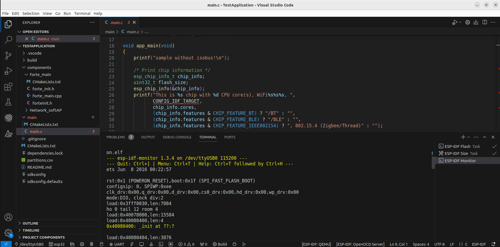

# ESP 4diac FORTE Library 

[English](README.md)

- [ESP 4diac FORTE Library](#esp-4diac-forte-library)
	- [概述](#概述)
	- [需求](#需求)
	- [Step 1. 将 4diac FORTE 编译为静态库](#step-1-将-4diac-forte-编译为静态库)
		- [Step 1.1. 获取源代码](#step-11-获取源代码)
		- [Step 1.2. 设置 CMake](#step-12-设置-cmake)
		- [Step 1.3. 配置编译器](#step-13-配置编译器)
		- [Step 1.5. 生成文件](#step-15-生成文件)
		- [Step 1.6. 构建 4diac FORTE](#step-16-构建-4diac-forte)
	- [Step 2. 将 4diac FORTE 静态库添加到 `ESP 4diac FORTE` 组件](#step-2-将-4diac-forte-静态库添加到-esp-4diac-forte-组件)
		- [Step 2.1. 克隆这个存储库](#step-21-克隆这个存储库)
		- [Step 2.2. 添加 FORTE 库](#step-22-添加-forte-库)
	- [Step 3. TestApplication - 示例 4diac FORTE 应用程序](#step-3-testapplication---示例-4diac-forte-应用程序)

## 概述

[ESP-4diac-FORTE](https://github.com/hikiku/esp-4diac-forte) 是一个标准的 [ESP-IDF](https://github.com/espressif/esp-idf) 组件。

4diac FORTE 是一个基于 IEC 61499 标准的开源 PLC 运行时框架。 本指南介绍了如何在 esp32 或 esp32s2 MCU 上运行它。 有关 4diac FORTE 的更多详细信息，请访问 https://www.eclipse.org/4diac/en_rte.php。

本库基于：

- [**4diac FORTE for FreeRTOS + LwIP**](https://eclipse.dev/4diac/en_help.php?helppage=html/installation/freeRTOSLwIP.html)
- [**4diac FORTE ESP32 Component**](https://gitlab.com/meisterschulen-am-ostbahnhof-munchen/4diac-forte-esp32-component) 
- [**ESP32 4diac Example Application**](https://gitlab.com/meisterschulen-am-ostbahnhof-munchen/esp32-4diac-example-application)

## 需求
- Linux 操作系统 - Ubuntu / Debian / Arch。
- Visual Studio Code。
- 支持 ESP32 芯片 的 Espressif 插件 - `Espressif IDF`, [安装并设置扩展](https://github.com/espressif/vscode-esp-idf-extension/blob/HEAD/docs/tutorial/install.md)。
- ESP-IDF - 应该已通过 VS Code 插件安装。
- Git, make, cmake 和 cmake-gui：
  	`sudo apt-get install git make cmake cmake-gui`

**另外，假设用户具有 C/C++ 编程、ESP32 平台和所需工具链的基本知识。**

在执行此说明之前最好先测试所有必需的工具。

## Step 1. 将 4diac FORTE 编译为静态库

### Step 1.1. 获取源代码
克隆最新的 4diac FORTE 存储库：

```bash
$ git clone https://git.eclipse.org/r/4diac/org.eclipse.4diac.forte.git
```

本文的工作目录是`/home/liang/secret/work/`。记住它，等下我们会多次用到它。 

### Step 1.2. 设置 CMake

1. 打开 CMake-GUI
   下一步在 forte 根文件夹中，创建构建目录并启动 cmake gui 工具。 它可以通过终端命令完成

	```bash
	$ cmake-gui
	```

2. 完成如图所示操作
   1. 设置 4diac FORTE 源代码路径，例如： `/home/liangz/secret/wrk/org.eclipse.4diac.forte`。
   2. 设置你想要创建的二进制库的路径，例如：`/home/liangz/secret/wrk/org.eclipse.4diac.forte/build`。 ~~通常使用 `bin/freeRTOS`。~~
   3. 按<kbd>Configure</kbd>，将出现带有配置向导的新窗口。

    

3. 在新窗口中选择正确的选项
   1. 选择您通常用来编译程序的工具。 此示例使用列表中的 `UNIX Makefiles`。
   2. 选择 `Specify options for cross-compiling`.
   3. 按下 <kbd>Next-></kbd>

   

4. 设置交叉编译。 您必须为 xtensa 架构选择 GCC 和 G++ 编译器
   1. 在 Operating System 写入**Generic**（一般是freeRTOS，不会影响编译）
   2. 在 Processor 写入 **esp32** 或 **esp32s2**
   3. 选择 C 交叉编译器的路径 **/home/liangz/.espressif/tools/xtensa-esp32-elf/esp-12.2.0_20230208/xtensa-esp32-elf/bin/xtensa-esp32-elf-gcc**
   4. 选择 C++ 交叉编译器的路径 **/home/liangz/.espressif/tools/xtensa-esp32-elf/esp-12.2.0_20230208/xtensa-esp32-elf/bin/xtensa-esp32-elf-g++**
   5. 目标根字段可以留空。
   6. 按下 <kbd>Finish</kbd>

   

### Step 1.3. 配置编译器

CMake 中应显示以红色显示 4diac FORTE 的所有变量的列表。


1. 对于 esp32，我们必须将 `FORTE_ARCHITECTURE` 变量设置为 `FreeRTOSLwIP`。 现在，当单击<kbd>Configure</kbd>时，大多数错误应该消失。

2. 检查 CMake 中显示的有关 LwIP 配置的信息。
3. 变量 `FORTE_FreeRTOSLwIP_INCLUDES` 现在应该出现，它是最重要的一个。 您应该将其设置为 freeRTOS 和 LwIP 标头所在的多个路径，每个路径用分号分隔。 例如： `${MAIN_DIRECTORY}/FreeRTOS/portable;${MAIN_DIRECTORY}/include;${MAIN_DIRECTORY}/lwip/src/include;${MAIN_DIRECTORY}/lwip/port` 其中 `${MAIN_DIRECTORY}` 是路径 其中有 freeRTOS 和 LwIP 代码。 当您稍后编译并失败并显示错误指出缺少某些 `includes` 时，应在缺少文件所在的文件夹中更新此变量。

   必须设置参数 `FORTE_FreeRTOSLwIP_INCLUDES`。 它需要用分号分隔路径的字符串来包含 esp-idf 中的文件夹。 有相当多的路径需要添加为包含路径。 下面是一个工作配置，请注意，所有这些路径都是**绝对**，因此您需要修改所有这些路径。 在大多数情况下，用 ESP-IDF 根目录路径替换所有出现的 `/home/liangz/esp/esp-idf` 就足够了。 例如使用 `/home/my_user/my_projects/my-idf_path`。

	```bash
	/home/liangz/test/blink/build/config;/home/liangz/esp/esp-idf/components/newlib/platform_include;/home/liangz/esp/esp-idf/components/freertos/FreeRTOS-Kernel/include;/home/liangz/esp/esp-idf/components/freertos/FreeRTOS-Kernel/include/freertos;/home/liangz/esp/esp-idf/components/freertos/FreeRTOS-Kernel/portable/xtensa/include;/home/liangz/esp/esp-idf/components/freertos/esp_additions/include/freertos;/home/liangz/esp/esp-idf/components/freertos/esp_additions/include;/home/liangz/esp/esp-idf/components/freertos/esp_additions/arch/xtensa/include;/home/liangz/esp/esp-idf/components/esp_hw_support/include;/home/liangz/esp/esp-idf/components/esp_hw_support/include/soc;/home/liangz/esp/esp-idf/components/esp_hw_support/include/soc/esp32;/home/liangz/esp/esp-idf/components/esp_hw_support/port/esp32/.;/home/liangz/esp/esp-idf/components/esp_hw_support/port/esp32/private_include;/home/liangz/esp/esp-idf/components/heap/include;/home/liangz/esp/esp-idf/components/log/include;/home/liangz/esp/esp-idf/components/soc/include;/home/liangz/esp/esp-idf/components/soc/esp32;/home/liangz/esp/esp-idf/components/soc/esp32/include;/home/liangz/esp/esp-idf/components/hal/esp32/include;/home/liangz/esp/esp-idf/components/hal/include;/home/liangz/esp/esp-idf/components/hal/platform_port/include;/home/liangz/esp/esp-idf/components/esp_rom/include;/home/liangz/esp/esp-idf/components/esp_rom/include/esp32;/home/liangz/esp/esp-idf/components/esp_rom/esp32;/home/liangz/esp/esp-idf/components/esp_common/include;/home/liangz/esp/esp-idf/components/esp_system/include;/home/liangz/esp/esp-idf/components/esp_system/port/soc;/home/liangz/esp/esp-idf/components/esp_system/port/include/private;/home/liangz/esp/esp-idf/components/xtensa/include;/home/liangz/esp/esp-idf/components/xtensa/esp32/include;/home/liangz/esp/esp-idf/components/lwip/include;/home/liangz/esp/esp-idf/components/lwip/include/apps;/home/liangz/esp/esp-idf/components/lwip/include/apps/sntp;/home/liangz/esp/esp-idf/components/lwip/lwip/src/include;/home/liangz/esp/esp-idf/components/lwip/port/include;/home/liangz/esp/esp-idf/components/lwip/port/freertos/include;/home/liangz/esp/esp-idf/components/lwip/port/esp32xx/include;/home/liangz/esp/esp-idf/components/lwip/port/esp32xx/include/arch
	```

	**注意**：用你的  `sdkconfig.h` 文件所在的路径，替换 `/home/liangz/test/blink/build/config`。
	
	<!-- -DESP_PLATFORM 
	-DIDF_VER=\"v5.1.2-dirty\" 
	-DMBEDTLS_CONFIG_FILE=\"mbedtls/esp_config.h\" -DSOC_MMU_PAGE_SIZE=CONFIG_MMU_PAGE_SIZE 
	-D_GNU_SOURCE 
	-D_POSIX_READER_WRITER_LOCKS  -->

	<!-- -mlongcalls -Wno-frame-address  -Wall -Wextra -Wwrite-strings -Wformat=2 -Wno-format-nonliteral -Wvla -Wlogical-op -Wshadow -Wformat-signedness -Wformat-overflow=2 -Wformat-truncation -Werror -Wmissing-declarations -Wmissing-prototypes -ffunction-sections -fdata-sections -Wall -Werror=all -Wno-error=unused-function -Wno-error=unused-variable -Wno-error=unused-but-set-variable -Wno-error=deprecated-declarations -Wextra -Wno-unused-parameter -Wno-sign-compare -Wno-enum-conversion -gdwarf-4 -ggdb -Og -fmacro-prefix-map=/home/liangz/test/hello_world=. -fmacro-prefix-map=/home/liangz/esp/esp-idf=/IDF -fstrict-volatile-bitfields -fno-jump-tables -fno-tree-switch-conversion -DconfigENABLE_FREERTOS_DEBUG_OCDAWARE=1 -std=gnu17 -Wno-old-style-declaration -MD -MT esp-idf/mbedtls/mbedtls/library/CMakeFiles/mbedx509.dir/x509_crt.c.obj -MF esp-idf/mbedtls/mbedtls/library/CMakeFiles/mbedx509.dir/x509_crt.c.obj.d -o esp-idf/mbedtls/mbedtls/library/CMakeFiles/mbedx509.dir/x509_crt.c.obj -c /home/liangz/esp/esp-idf/components/mbedtls/mbedtls/library/x509_crt.c -->

4. 您可能还需要使用硬件所需的标志来设置 `CMAKE_C_FLAGS` 和 `CMAKE_CXX_FLAGS` 变量。 您可以从跨 IDE 中示例项目的属性中检查需要哪些标志。

	一旦您提交了 freertos 包含文件，您就需要添加一些额外的*compiler flags*。 为此，您需要激活 cmake 程序右上角的 `Advanced` 复选框。 一旦你拥有它，你将能够看到更多可以调整的选项。

    您必须添加的*Flags*：
	`-mlongcalls -ffunction-sections -fdata-sections -fno-threadsafe-statics -fno-rtti -fno-exceptions -DconfigMINIMAL_STACK_SIZE_FORTE=15000`

	所有这些都必须添加到 `CMAKE_C_FLAGS` 和 `CMAKE_CXX_FLAGS` 的所有变体中。 有：`DEBUG、MINISIZEREL RELEASE、REALWITHDEBINFO`

	它看起来应该类似于下图：

	   

5. 下一个要设置的选项是将 `FORTE_TicksPerSecond` 选项设置为 **100** 而不是 1000。它在 advanced 模式下也可见。
6. 我们还需要告诉 cmake 我们想要构建静态库而不是可执行文件。 为此，您必须将 `FORTE_BUILD_EXECUTABLE` 设置为 *false/deselect* ，并将 `FORTE_BUILD_STATIC_LIBRARY` 设置为 *true/select*。
7. 对于第一次测试，最好在 FORTE 中启用调试功能，这样我们就可以看到更多日志。 这在第一次运行时非常有用，因此我们可以看到一切都按预期运行。 为此，请在 `CMAKE_BUILD_TYPE` 中输入：`DEBUG` 并将 `FORTE_LOGLEVEL` 切换为 `LOGDEBUG`。 **不幸的是** 每次我们触发配置时，`FORTE_LOGLEVEL` 选项都会自动切换回 `NOLOG` ，因此当我们进行一些更改并且希望获得日志时，记住这一点很重要。
<!-- 8. freeRTOS with LwIP arch needs the following flags to be defined (please do it in lwipopts.h, e.g.：`/home/liangz/esp/esp-idf/components/lwip/port/include/lwipopts.h`)：
	```C
	#define LWIP_COMPAT_SOCKETS 1
	#define LWIP_IGMP 1 //to use IP_ADD_MEMBERSHIP
	#define LWIP_TIMEVAL_PRIVATE 0 //This is optional. Set this flag if you get a compilation error about redefinition of struct timeval
	``` -->

8. 单击<kbd>Configure</kbd>，需要修改的变量将再次显示为红色，其余变量显示为白色。 ~~检查这些变量并按<kbd>Configure</kbd>，直到没有变量显示为红色。 在这里你可以添加你想要 FORTE 拥有的模块，但是从 freeRTOS 的角度来看，没有其他你需要的了~~

**汇总我们在这里所做的更改：**

- `FORTE_ARCHITECTURE` 设置为 `FreeRTOSLwIP`
- `FORTE_FreeRTOSLwIP_INCLUDES` 填入所有 FreeRTOS include 路径
- `CMAKE_C_FLAGS`, `CMAKE_CXX_FLAGS` 和它们所有带有 `DEBUG, MINISIZEREL RELEASE, REALWITHDEBINFO` 的变体 - 添加 compilers flags
- `FORTE_TicksPerSecond` 设置为 100
- `FORTE_BUILD_EXECUTABLE` 取消选择
- `FORTE_BUILD_STATIC_LIBRARY` 选中
- `CMAKE_BUILD_TYPE` 输入 `DEBUG`, `FORTE_LOGLEVEL` 设置为 `LOGDEBUG` 


<!-- ### Step 1.5. Comment out connect()

Comment out connect() from FORTE source code.

At this point we can do the <kbd>configuration</kbd> and <kbd>generation</kbd> with cmake. But still we need to do some small change to FORTE code. Becasue esp-idf has it's own implementation of connect() function which wraps lwip_connect() we need to comment out connect function definition from FORTE source. Other way we will get compilation errors saying that we have redefinition of this function. 
The change has to be done in file `${FORTE_ROOT}/src/arch/freeRTOS/sockhand.h`. The function `connect(int s, const struct sockaddr *name, socklen_t namelen) `has to be commented.

so we change

```C
inline int connect(int s, const struct sockaddr *name, socklen_t namelen) {
	return lwip_connect(s, name, namelen);
}
```


to

```C
//inline int connect(int s, const struct sockaddr *name, socklen_t namelen) {
//  return lwip_connect(s, name, namelen);
//}
```

Once you have changed this file, save it, close and we can try first FORTE compilation for esp32 platform. -->

### Step 1.5. 生成文件

* 按下 <kbd>Generate</kbd>

### Step 1.6. 构建 4diac FORTE
*  转到最近生成的文件夹（例如： `${FORTE_ROOT}/build/src`）并输入 `make -j`，你的 make 工具应该开始执行所有工作：

	```bash
	$ cd ${FORTE_ROOT}/build/src   # cd bin/freeRTOS
	$ make -j
	```

* 如果出现错误，请再次检查 CMake 中的变量，特别是 `FORTE_FreeRTOSLwIP_INCLUDES`、`CMAKE_C_FLAGS` 和 `CMAKE_CXX_FLAGS`。

* 如果没有发生错误，经过一段时间后，您应该已经构建了 FORTE 静态库，如下图所示：

    

* 现在你可以在 `${FORTE_ROOT}/build/src` ~~`bin/freeRTOS/src`~~ 中找到名为 `libforte-static.a` 的静态库。 我们将使用这个库来准备我们的 ESP 组件，以便它可以直接在 esp 项目中使用。

## Step 2. 将 4diac FORTE 静态库添加到 `ESP 4diac FORTE` 组件

### Step 2.1. 克隆这个存储库

转到您的工作目录并输入：

```bash
$ cd <your-working-directory>
$ git clone https://github.com/hikiku/esp-4diac-forte.git
```

<!-- $ cd /home/liangz/secret/wrk -->

### Step 2.2. 添加 FORTE 库

此时您可以将静态库复制到 FORTE 组件文件夹中。

最好创建一个符号链接而不是静态库的硬拷贝。 为此，您可以在 shell 中使用 `ln` 命令。

`ln -s [soruce file] [destination file]`

例如：

```bash
$ cd <your-working-directory>/esp32-4diac-forte/lib/esp32/src
$ mv libforte-static.a libforte-static.a.origin
$ ln -s <your-working-directory>/org.eclipse.4diac.forte/build/src/libforte-static.a libforte-static.a
```

<!--
$ cd /home/liangz/secret/wrk/esp32-4diac-forte/lib/esp32/src
$ mv libforte-static.a libforte-static.a.origin
$ ln -s /home/liangz/secret/wrk/org.eclipse.4diac.forte/build/src/libforte-static.a libforte-static.a
-->

<!-- `ln -s /home/liangz/secret/wrk/org.eclipse.4diac.forte/build/src/libforte-static.a /home/liangz/esp/esp-idf/components/4diac-forte-esp32-component/forte.a` -->

这样您就不必每次重建库时都复制它。

## Step 3. TestApplication - 示例 4diac FORTE 应用程序

要测试您的 FORTE buld，您需要从头开始准备示例应用程序或使用已经准备好的示例应用程序。 本指南不会介绍如何从头开始创建新项目，而是我们将在此处使用一个已经准备好的示例 - `<your_working_dicrotry>/esp-4diac-forte/test_apps/TestApplication/`。

<!-- Clone the git repository 
```bash
$ git clone https://gitlab.com/meisterschulen-am-ostbahnhof-munchen/esp32-4diac-example-application.git
```
-->

打开 Visual Studio Code，然后加载此 4diac FORTE 示例应用程序项目。

如果一切都正确安装，项目应该可以毫无问题地构建。 构建完成后，刷新并打开 ESP-IDF 监视设备。

完成后，您应该会看到 4diac FORTE 已启动并正在运行。

* <kbd>CTRL</kbd>+<kbd>Shift</kbd>+<kbd>P</kbd> -> `ESP-IDF:>Set Espressif device target`

* (可选) 配置你的 SPI Flash： <kbd>CTRL</kbd>+<kbd>Shift</kbd>+<kbd>P</kbd> -> `ESP-IDF:>SDK Configuration Editor (menuconfig)`：
	```menuconfig
	Serial flasher config
		-> Flash SPI speed (40 MHz)
		-> Flash size (4 MB)
	```

* (可选) 修改你的 SPI flash 分区表 - `partion.csv`：

	```csv
	# Name,   Type, SubType, Offset,  Size, Flags
	# Note: if you have increased the bootloader size, make sure to update the offsets to avoid overlap
	nvs,      data, nvs,     0x9000,  0x6000,
	phy_init, data, phy,     0xf000,  0x1000,
	factory,  app,  factory, 0x10000, 3M,
	storage,  data, spiffs,  ,        0xF0000,
	```

* <kbd>CTRL</kbd>+<kbd>Shift</kbd>+<kbd>P</kbd> -> `ESP-IDF:>Build your project`

  

* <kbd>CTRL</kbd>+<kbd>Shift</kbd>+<kbd>P</kbd> -> `ESP-IDF:>Select Port to Use(COM,tty,usbserial)`

* <kbd>CTRL</kbd>+<kbd>Shift</kbd>+<kbd>P</kbd> -> `ESP-IDF:>Flash your project`

* <kbd>CTRL</kbd>+<kbd>Shift</kbd>+<kbd>P</kbd> -> `ESP-IDF:>Monitor your project`

  


	```info
	ets Jun  8 2016 00:22:57

	rst:0x1 (POWERON_RESET),boot:0x1f (SPI_FAST_FLASH_BOOT)
	configsip: 0, SPIWP:0xee
	clk_drv:0x00,q_drv:0x00,d_drv:0x00,cs0_drv:0x00,hd_drv:0x00,wp_drv:0x00
	mode:DIO, clock div:2
	load:0x3fff0030,len:7084
	ho 0 tail 12 room 4
	load:0x40078000,len:15584
	load:0x40080400,len:4
	0x40080400: _init at ??:?

	load:0x40080404,len:3876
	entry 0x4008064c
	I (31) boot: ESP-IDF v5.1.2-dirty 2nd stage bootloader
	I (31) boot: compile time Feb  4 2024 12:55:18
	I (31) boot: Multicore bootloader
	I (36) boot: chip revision: v1.0
	I (40) boot.esp32: SPI Speed      : 40MHz
	I (44) boot.esp32: SPI Mode       : DIO
	I (49) boot.esp32: SPI Flash Size : 4MB
	I (54) boot: Enabling RNG early entropy source...
	I (59) boot: Partition Table:
	I (63) boot: ## Label            Usage          Type ST Offset   Length
	I (70) boot:  0 nvs              WiFi data        01 02 00009000 00006000
	I (77) boot:  1 phy_init         RF data          01 01 0000f000 00001000
	I (85) boot:  2 factory          factory app      00 00 00010000 00300000
	I (92) boot:  3 storage          Unknown data     01 82 00310000 000f0000
	I (100) boot: End of partition table
	I (104) esp_image: segment 0: paddr=00010020 vaddr=3f400020 size=26954h (158036) map
	I (170) esp_image: segment 1: paddr=0003697c vaddr=3ffb0000 size=03c4ch ( 15436) load
	I (176) esp_image: segment 2: paddr=0003a5d0 vaddr=40080000 size=05a48h ( 23112) load
	I (186) esp_image: segment 3: paddr=00040020 vaddr=400d0020 size=aa750h (698192) map
	I (438) esp_image: segment 4: paddr=000ea778 vaddr=40085a48 size=10838h ( 67640) load
	I (478) boot: Loaded app from partition at offset 0x10000
	I (478) boot: Disabling RNG early entropy source...
	I (489) cpu_start: Multicore app
	I (490) cpu_start: Pro cpu up.
	I (490) cpu_start: Starting app cpu, entry point is 0x400813fc
	0x400813fc: call_start_cpu1 at /home/liangz/esp/esp-idf/components/esp_system/port/cpu_start.c:157

	I (0) cpu_start: App cpu up.
	I (507) cpu_start: Pro cpu start user code
	I (508) cpu_start: cpu freq: 160000000 Hz
	I (508) cpu_start: Application information:
	I (512) cpu_start: Project name:     TestApplication
	I (518) cpu_start: App version:      14d6a8b-dirty
	I (523) cpu_start: Compile time:     Feb  4 2024 13:27:56
	I (529) cpu_start: ELF file SHA256:  41063bad2d5194cf...
	I (535) cpu_start: ESP-IDF:          v5.1.2-dirty
	I (541) cpu_start: Min chip rev:     v0.0
	I (545) cpu_start: Max chip rev:     v3.99 
	I (550) cpu_start: Chip rev:         v1.0
	I (555) heap_init: Initializing. RAM available for dynamic allocation:
	I (562) heap_init: At 3FFAE6E0 len 00001920 (6 KiB): DRAM
	I (568) heap_init: At 3FFB8610 len 000279F0 (158 KiB): DRAM
	I (575) heap_init: At 3FFE0440 len 00003AE0 (14 KiB): D/IRAM
	I (581) heap_init: At 3FFE4350 len 0001BCB0 (111 KiB): D/IRAM
	I (587) heap_init: At 40096280 len 00009D80 (39 KiB): IRAM
	I (595) spi_flash: detected chip: generic
	I (598) spi_flash: flash io: dio
	I (606) app_start: Starting scheduler on CPU0
	I (607) app_start: Starting scheduler on CPU1
	I (607) main_task: Started on CPU0
	I (617) main_task: Calling app_main()
	sample without isobus!
	This is esp32 chip with 2 CPU core(s), WiFi/BT/BLE, silicon revision v1.0, 4MB external flash
	Minimum free heap size: 274828 bytes
	CONFIG_FREERTOS_HZ: 1000 must be 1000 !!!! (200Hz at least for 5ms )
	app_main starting 
	I (664) wifi softAP: ESP_WIFI_MODE_AP
	I (669) wifi:wifi driver task: 3ffc0f90, prio:23, stack:6656, core=0
	I (680) wifi:wifi firmware version: 91b9630
	I (681) wifi:wifi certification version: v7.0
	I (681) wifi:config NVS flash: enabled
	I (681) wifi:config nano formating: disabled
	I (685) wifi:Init data frame dynamic rx buffer num: 32
	I (690) wifi:Init static rx mgmt buffer num: 5
	I (694) wifi:Init management short buffer num: 32
	I (698) wifi:Init dynamic tx buffer num: 32
	I (702) wifi:Init static rx buffer size: 1600
	I (706) wifi:Init static rx buffer num: 10
	I (710) wifi:Init dynamic rx buffer num: 32
	I (715) wifi_init: rx ba win: 6
	I (718) wifi_init: tcpip mbox: 32
	I (722) wifi_init: udp mbox: 6
	I (726) wifi_init: tcp mbox: 6
	I (729) wifi_init: tcp tx win: 5744
	I (733) wifi_init: tcp rx win: 5744
	I (738) wifi_init: tcp mss: 1440
	I (742) wifi_init: WiFi IRAM OP enabled
	I (746) wifi_init: WiFi RX IRAM OP enabled
	W (1003) wifi:Configuring PMF required implicitly for authmode WIFI_AUTH_WPA3_PSK
	I (1006) phy_init: phy_version 4780,16b31a7,Sep 22 2023,20:42:16
	I (1083) wifi:mode : softAP (bc:dd:c2:d1:be:b1)
	I (1222) wifi:Total power save buffer number: 16
	I (1223) wifi:Init max length of beacon: 752/752
	I (1224) wifi:Init max length of beacon: 752/752
	I (1227) wifi softAP: wifi_init_softap finished. SSID:ESP_D1BEB1 password:esp32_pwd channel:1
	I (1228) esp_netif_lwip: DHCP server started on interface WIFI_AP_DEF with IP: 192.168.4.1
	I (1243) MAIN: Executing forte...
	I (1257) MAIN: OK 0 , Could start forte

	forte_main done 
	I (3243) main_task: Returned from app_main()
	```

现在您可以部署示例应用程序。要使用 FORTE 构建示例应用程序，请参阅 FORTE 文档：[Step 1 - Use 4diac Locally (Blinking Tutorial)]( https://www.eclipse.org/4diac/en_help.php?helppage=html/4diacIDE/use4diacLocally.html")。

如果一切都正确完成，您应该成功部署您的应用程序。Enjoy!
